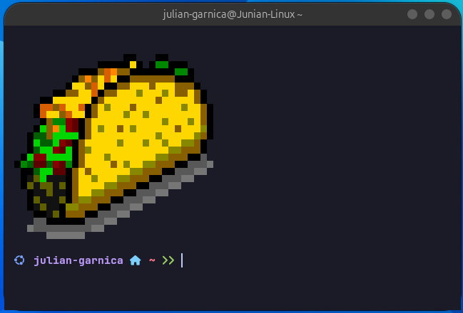
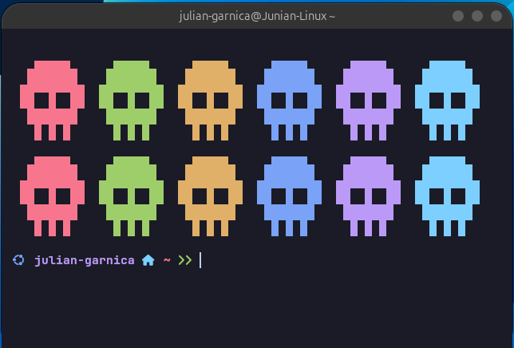
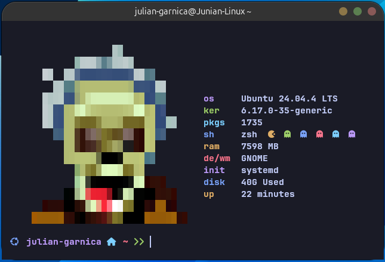

# Ubuntu Terminal Rice

Configuracion de terminal extraida de los dotfiles originales de [gh0stzk/dotfiles](https://github.com/gh0stzk/dotfiles) y simplificada para usarse como kit independiente en Ubuntu.


Este repositorio ya no instala un entorno BSPWM completo. Solo conserva lo necesario para reproducir la experiencia de terminal:

- Kitty
- Alacritty
- Ghostty
- Zsh
- Prompt personalizado
- Plugins de zsh
- Fuentes para terminal
- Scripts CLI pequenos (`colorscript`, `sysfetch`)
- Tema de colores tipo Tokyo Night / Emilia para Kitty y Alacritty

## Vista Previa







## Estructura

```text
.
|-- config/
|   |-- alacritty/
|   |-- ghostty/
|   |-- kitty/
|   `-- zsh/
|-- home/
|   `-- .zshrc
|-- images/
|   |-- image.png
|   |-- image1.png
|   `-- image2.png
|-- misc/
|   |-- asciiart/
|   |-- bin/
|   `-- fonts/
`-- setup-ubuntu-terminal.sh
```

## Instalacion En Ubuntu

Ejecuta el instalador desde la raiz del repositorio:

```bash
chmod +x setup-ubuntu-terminal.sh
./setup-ubuntu-terminal.sh
```

El script hace lo siguiente:

- Instala paquetes base con `apt`.
- Instala `JetBrainsMono Nerd Font`.
- Copia configuraciones de Kitty, Alacritty y Zsh.
- Copia fuentes incluidas en `misc/fonts`.
- Copia `colorscript` y `sysfetch` a `~/.local/bin`.
- Adapta rutas de plugins de zsh para Ubuntu.
- Cambia el icono del prompt de Arch a Ubuntu.
- Desactiva aliases pensados para Arch.
- Cambia tu shell por defecto a `zsh`.
- Crea backups en `~/.RiceBackup/ubuntu-terminal-*`.

Al terminar, cierra sesion y vuelve a entrar para que el cambio de shell tome efecto.

## Instalacion Manual

Instala dependencias:

```bash
sudo apt update
sudo apt install -y alacritty kitty zsh git curl unzip fzf bat fonts-jetbrains-mono zsh-autosuggestions zsh-syntax-highlighting
sudo apt install -y eza
```

Si `eza` no existe en tu version de Ubuntu, puedes omitirlo.

Instala la Nerd Font:

```bash
mkdir -p ~/.local/share/fonts/JetBrainsMonoNerd
cd /tmp
curl -fLO https://github.com/ryanoasis/nerd-fonts/releases/latest/download/JetBrainsMono.zip
unzip -o JetBrainsMono.zip -d ~/.local/share/fonts/JetBrainsMonoNerd
fc-cache -fv
```

Copia configuraciones:

```bash
mkdir -p ~/.config ~/.local/bin ~/.local/share/fonts

cp -R config/alacritty ~/.config/
cp -R config/kitty ~/.config/
cp -R config/ghostty ~/.config/
cp -R config/zsh ~/.config/
cp -R misc/asciiart ~/.local/share/
cp -R misc/fonts ~/.local/share/fonts/dotfiles-terminal
cp misc/bin/colorscript ~/.local/bin/
cp misc/bin/sysfetch ~/.local/bin/
cp home/.zshrc ~/.zshrc

chmod +x ~/.local/bin/colorscript ~/.local/bin/sysfetch
fc-cache -fv
```

Instala plugins que no siempre vienen empaquetados en Ubuntu:

```bash
sudo mkdir -p /usr/share/zsh/plugins

sudo git clone --depth=1 https://github.com/Aloxaf/fzf-tab \
  /usr/share/zsh/plugins/fzf-tab-git

sudo git clone --depth=1 https://github.com/zsh-users/zsh-history-substring-search \
  /usr/share/zsh/plugins/zsh-history-substring-search
```

Cambia tu shell:

```bash
chsh -s "$(command -v zsh)"
```

## Uso

Abrir Kitty:

```bash
kitty
```

Abrir Alacritty:

```bash
alacritty
```

Abrir Ghostty:

```bash
ghostty
```

Ejecutar arte ASCII aleatorio:

```bash
colorscript -r
```

Ejecutar fetch minimalista:

```bash
sysfetch
```

## Kitty

El archivo principal es:

```text
config/kitty/kitty.conf
```

La configuracion actual usa barra superior del sistema:

```conf
hide_window_decorations no
```

Atajos utiles:

```text
Ctrl + Shift + W      cerrar pestana o ventana actual
Ctrl + Shift + Q      cerrar Kitty
Ctrl + Shift + Enter  nueva division/ventana interna
Ctrl + Shift + T      nueva pestana
Ctrl + Shift + C      copiar
Ctrl + Shift + V      pegar
Ctrl + Shift + +      aumentar fuente
Ctrl + Shift + -      reducir fuente
```

## Alacritty

El archivo principal es:

```text
config/alacritty/alacritty.toml
```

Importa:

```toml
import = ["rice-colors.toml", "fonts.toml"]
```

El tema actual esta en:

```text
config/alacritty/rice-colors.toml
```

La fuente esta en:

```text
config/alacritty/fonts.toml
```

## Zsh

El prompt y los aliases estan en:

```text
home/.zshrc
```

El prompt usa iconos de Nerd Font. Si ves cuadros vacios, revisa que tu terminal use:

```text
JetBrainsMono Nerd Font
```

## VS Code

VS Code no puede incrustar Kitty dentro del terminal integrado. El terminal integrado usa su propio emulador. Puedes usar `zsh` y la misma fuente dentro de VS Code:

```json
{
  "terminal.integrated.defaultProfile.linux": "zsh",
  "terminal.integrated.fontFamily": "JetBrainsMono Nerd Font",
  "terminal.integrated.fontSize": 13
}
```

Para abrir Kitty como terminal externa desde VS Code:

```json
{
  "terminal.external.linuxExec": "kitty"
}
```

Luego ejecuta el comando de VS Code:

```text
Terminal: Open New External Terminal
```

## Restaurar Backup

El instalador mueve configuraciones existentes a:

```text
~/.RiceBackup/ubuntu-terminal-YYYYMMDD-HHMMSS
```

Para restaurar manualmente, copia de vuelta los archivos que necesites desde ese directorio hacia tu `$HOME`.

## Notas

- El instalador esta pensado para Ubuntu.
- No instala BSPWM, Polybar, Rofi, Neovim, Firefox ni temas GTK.
- Ghostty se conserva como configuracion, pero el script no lo instala porque su disponibilidad depende de la version de Ubuntu y del metodo de instalacion que uses.
- Este proyecto es una version reducida y adaptada. El repo original completo es [gh0stzk/dotfiles](https://github.com/gh0stzk/dotfiles).
